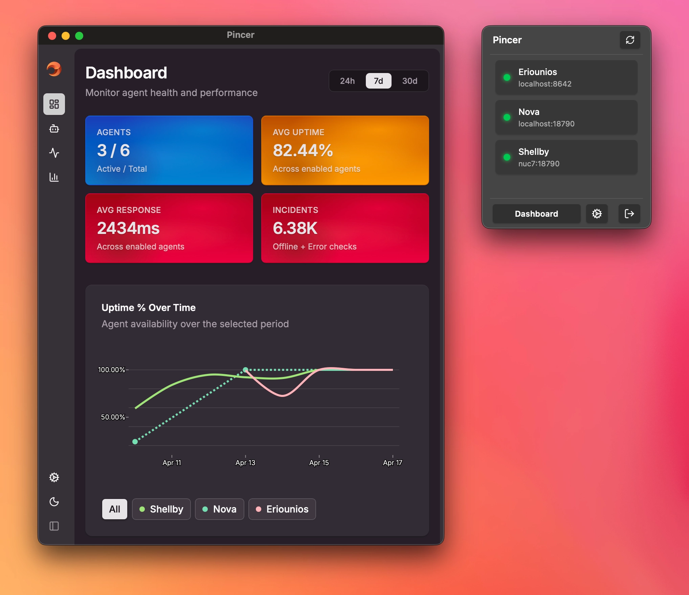
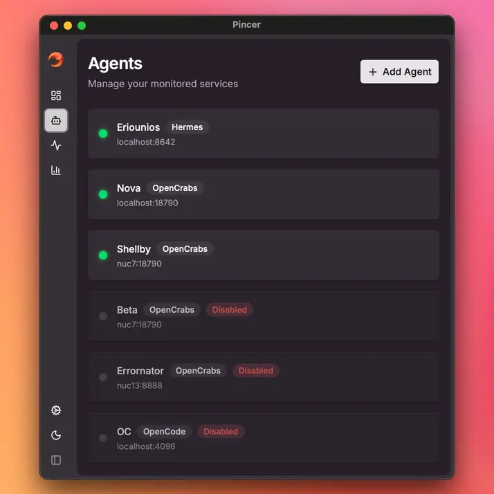
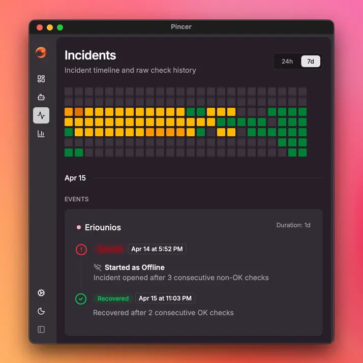
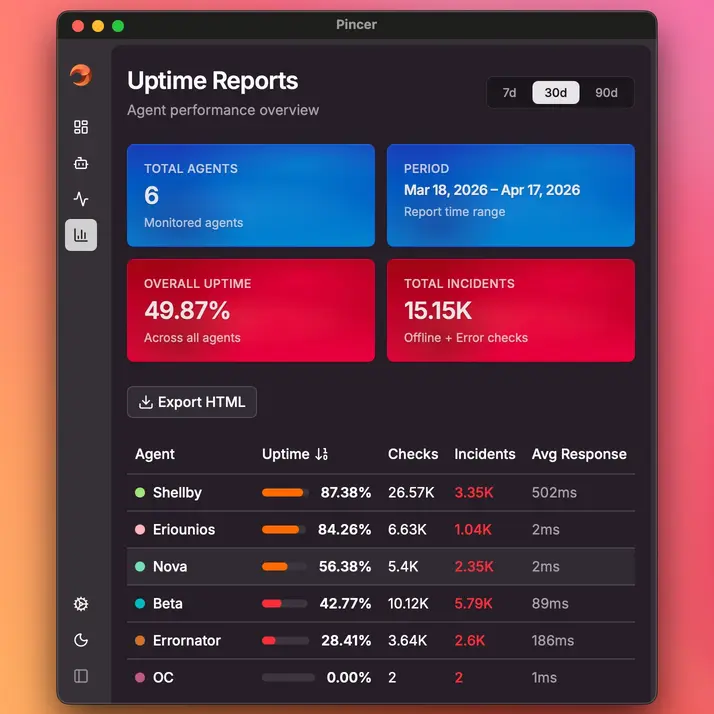
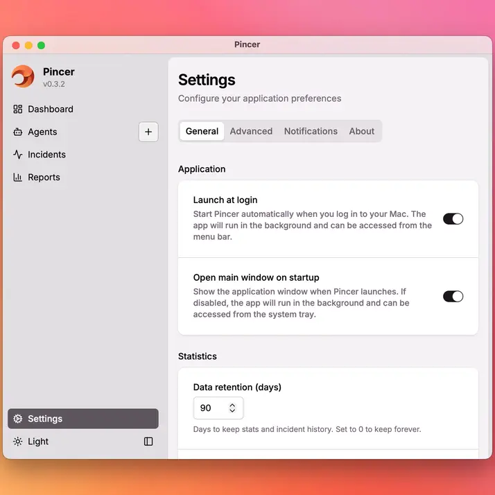

<div align="center">

<h1>Pincer</h1>

Desktop monitoring for local AI agents.<br />Check health, status, and charts from your system tray, without leaving your workflow.

[Changelog](./CHANGELOG.md) · [Report Bug](https://github.com/mariodian/pincer/issues/new?template=bug-report.md) · [Request Feature](https://github.com/mariodian/pincer/issues/new?template=feature-request.md)


</div>

## ⚡ Quick Start

```bash
git clone https://github.com/mariodian/pincer.git
cd pincer
bun install && bun run dev
```

Pincer will appear in your system tray.

## 📋 Table of Contents

- ⚡ [Quick Start](#quick-start)
- 🤔 [Why Pincer?](#why-pincer)
- ✨ [Features](#features)
- 📥 [Installation](#installation)
  - ✅ [Requirements](#requirements)
- 🚀 [Usage](#usage)
- ⚠️ [Known Limitations](#known-limitations)
- 🔧 [Troubleshooting](#troubleshooting)
- 💬 [Contributing](#contributing)
- 📜 [License](#license)
- 📌 [Credits](#credits)

## 🤔 Why Pincer?

Running multiple local AI agents means constantly switching between terminals and browser tabs just to check what's healthy and what's not. Pincer lives in your system tray and gives you instant visibility into agent health, status history, and usage charts — no context switching required.

<table border="0" align="center" cellspacing="0" cellpadding="10">
  <tr>
    <td colspan="4" align="center" valign="middle">
      <a href="media/screenshots/dashboard-tray.webp"></a>
    </td>
  </tr>
  <tr>
    <td width="25%" align="center" valign="middle">
      <a href="media/screenshots/agents.webp"></a>
    </td>
    <td width="25%" align="center" valign="middle">
      <a href="media/screenshots/incidents.webp"></a>
    </td>
    <td width="25%" align="center" valign="middle">
      <a href="media/screenshots/reports.webp"></a>
    </td>
    <td width="25%" align="center" valign="middle">
      <a href="media/screenshots/light-mode.webp"></a>
    </td>
  </tr>
</table>

## ✨ Features

- **Tray-first monitoring**: live agent status from the system tray
- **Dashboards and trends**: KPIs, charts, and response-time history
- **Incidents and checks**: timeline + heatmap over 24h/7d windows
- **Reports**: per-agent uptime summary with HTML export
- **Flexible controls**: polling, retention, notifications, startup, and auto-update settings
- **Local and cross-platform**: SQLite-backed, runs on macOS, Windows, and Linux
- **Agent support**: [OpenClaw](https://github.com/openclaw/openclaw), [OpenCrabs](https://github.com/adolfousier/opencrabs), [Hermes](https://github.com/nousresearch/hermes-agent), [OpenCode](https://github.com/anomalyco/opencode), and custom HTTP health endpoints

## 📥 Installation

### Homebrew (macOS)

```bash
brew tap mariodian/tap
brew install --cask pincer
```

### From source

```bash
git clone https://github.com/mariodian/pincer.git
cd pincer
bun install
```

### ✅ Requirements

- [Bun](https://bun.sh) v1.0+
- macOS 13+, Windows 10+, or Linux (GTK3)
- Xcode Command Line Tools (macOS only, required for native vibrancy effects)

## 🚀 Usage

```bash
# Full desktop dev flow
bun run dev

# Fast renderer iteration with HMR + desktop runtime
bun run dev:hmr

# Production build
bun run build

# Environment-based builds
bun run build:canary
bun run build:stable
```

## ⚠️ Known Limitations

- Native vibrancy and traffic-light customization is macOS-only
- The custom tray menu is macOS-only; Windows and Linux fall back to the native tray

## 🔧 Troubleshooting

### App won't launch on macOS

If macOS blocks the app from opening because it is quarantined, run:

```bash
xattr -r -d com.apple.quarantine /Applications/Pincer.app
```

### HMR not updating in secondary windows

Verify dev windows use `http://localhost:5173/...` URLs.

### Weak vibrancy on macOS

Window blur effects may appear weak if transparency is enabled in system settings. Check _System Settings → Accessibility → Reduce transparency_ and disable it for full vibrancy effects.

## ❤️ Like This Project?

If Pincer is useful to you, consider leaving a star on GitHub and sharing it with others.

<a href="https://twitter.com/intent/tweet?url=https%3A%2F%2Fgithub.com%2Fmariodian%2Fpincer&text=Stop%20switching%20between%20terminals%20to%20check%20AI%20agent%20health.%20%0A%0APincer%20lives%20in%20your%20system%20tray.%0A%0AGitHub%3A&via=mariodian" target="_blank" rel="noopener noreferrer" style="display: inline-flex; align-items: center; justify-content: center; gap: 8px; padding: 10px 20px; color: #fff; background-color: #000000; text-decoration: none; border-radius: 5px; font-family: sans-serif; font-weight: bold; font-size: 1rem;">
<svg width="24" height="24" fill="#fff" viewBox="0 0 24 24"><path d="M18.244 2.25h3.308l-7.227 8.26 8.502 11.24H16.17l-5.214-6.817L4.99 21.75H1.68l7.73-8.835L1.254 2.25H8.08l4.713 6.231zm-1.161 17.52h1.833L7.084 4.126H5.117z"/></svg>
<span>Share on X (Twitter)</span>
</a>

## 💬 Contributing

See [CONTRIBUTING.md](./CONTRIBUTING.md) for development guidelines.

## 📜 License

MIT. See [LICENSE](LICENSE).

## 📌 Credits

Feel free to remove this section. Otherwise, credit is appreciated.

[Pincer on GitHub](https://github.com/mariodian/pincer) · [Mario Dian on X](https://x.com/mariodian)
